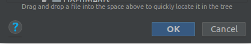

# OCR-Project-3

nouvelles fonctionnalités de l'application Entrevoisins

Comment exécuter et compiler le projet:

Click sur clone or download et copier le lien fourni.

Ouvrez le cmd

Poisitionnez vous sur le dossier contenant vos projets Android Studio.

Clonnez le repository à l'aide la commande:

Si le clonnage est réussi un message de réussite devrait s'afficher.

Ouvrez Android Studio

Dans la page d'acceuil séléctionnez "Open an existing Android Studio project".

Positionnez vous dans le dossier parent contenant le repository que vous venez de clonner.

Sélectionnez le projet a l'intérieur du dossier OCR-Project-3.

Click sur ok.

La fenêtre suivante vous permet de définir le framework, clickez sur ok

et voilà le projet devrait ce charger avec succées

